# Fake News Detector - Deep Learning University Project

- 6311374 Suphawith Phusanbai
- 6420063 Kritsada Kruapat
  
We have decided to make an improvement and reduce overfiting on this [Fake News Detector RNN](https://www.kaggle.com/code/muhammadwaseem123/fake-news-detector-rnn) notebook and use this as the baseline model (lstm model)
## Clean & tokenization data :

[Clean & tokenize Kaggle dataset](https://drive.google.com/file/d/1gD_Q-ksCZlJfgKA22qxpt3TujxLBw4JT/view?usp=share_link)

[Clean & tokenize Hugging Face dataset](https://drive.google.com/file/d/1fOVo2Wh4scjYNs7PjEA-wHtc3wlWGQfe/view?usp=sharing)

1. **Remove Unnamed Columns:** Any unnamed columns are removed to clean up the dataset.
2. **Handle Missing Values:** Missing or empty values in the `text` column are filled with the word "missing."
3. **Convert to Lowercase:** All text in the `text` column is converted to lowercase.
4. **Remove Punctuation:** Punctuation is removed from the text to leave only words and spaces.
5. **Remove Stopwords:** Common words (like "the", "and", "is") that don't add much meaning are removed using NLTK’s stopwords.
6. **Tokenization:** The cleaned text is split into individual words (tokens), excluding non-alphanumeric characters.
7. **Lemmatization:** Words are reduced to their base form (e.g., "running" becomes "run") to standardize them for better processing.
   
---
## Base Model
We use dataset from [Kaggle](https://www.kaggle.com/datasets/saurabhshahane/fake-news-classification), Clean & tokenization data  then split it train:test 80:20
, use model architect of this notebook [Fake News Detector RNN](https://www.kaggle.com/code/muhammadwaseem123/fake-news-detector-rnn).
Create a ModelCheckpoint callback that saves the model's weights every 5 epochs ,Create an EarlyStopping callback that stops training when the validation loss has not improved for 3 consecutive epochs here is result:

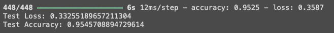

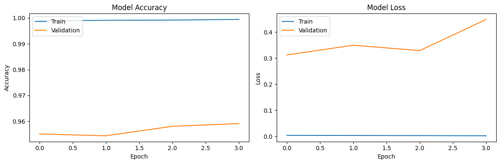

**Model Accuracy:**
The training accuracy is very high (almost 100%) after just a few epochs, while the validation accuracy is much lower and remains almost flat, around 96%.

The gap between training accuracy and validation accuracy is significant, which could be an indicator of overfitting.

**Model Loss:**
The training loss is very low, near zero, while the validation loss starts at a moderate value and keeps increasing.

The growing gap between training and validation loss is another indicator of overfitting. This shows that while the model is learning the training data perfectly, it is struggling to generalize to the validation data.

#  🔎🔬🧑🏽‍🔬🧪🔬🔎 Time to Experiment 🔎🧑🏽‍🔬🔬🧪🧪🔬
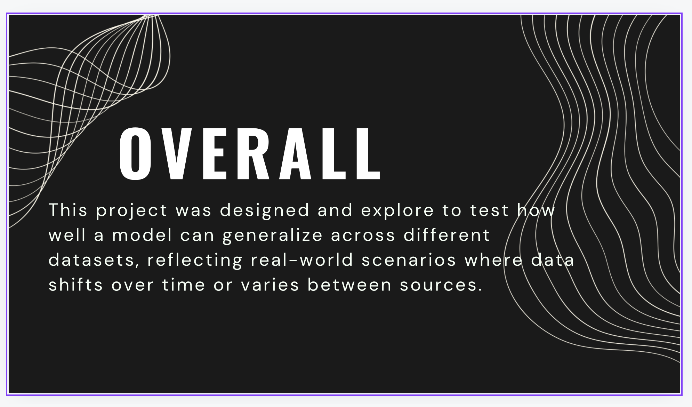
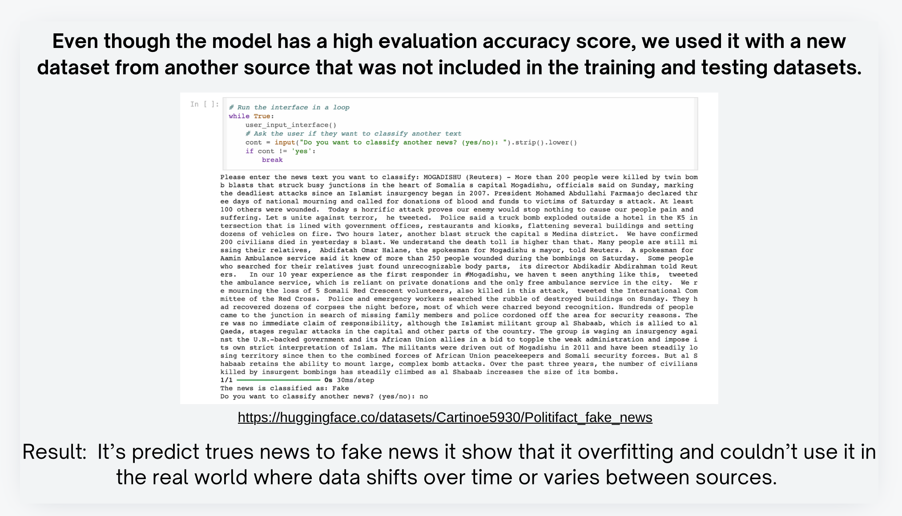
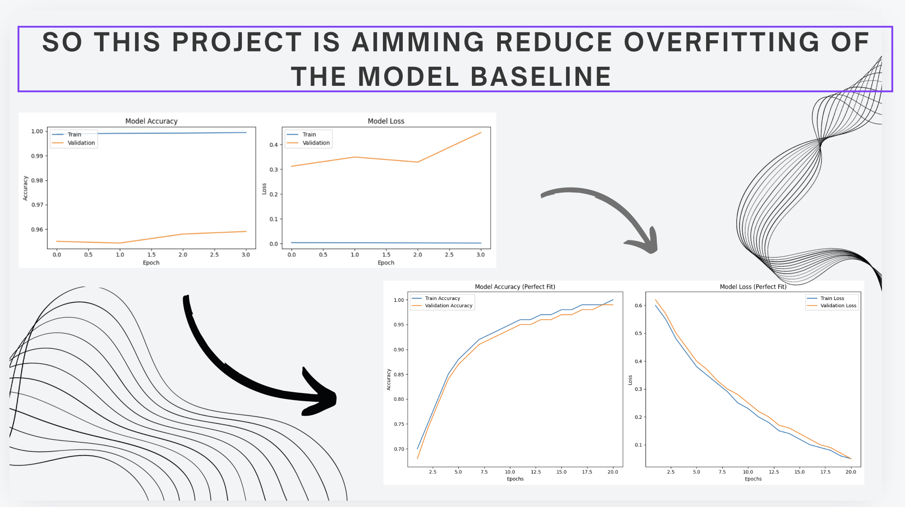
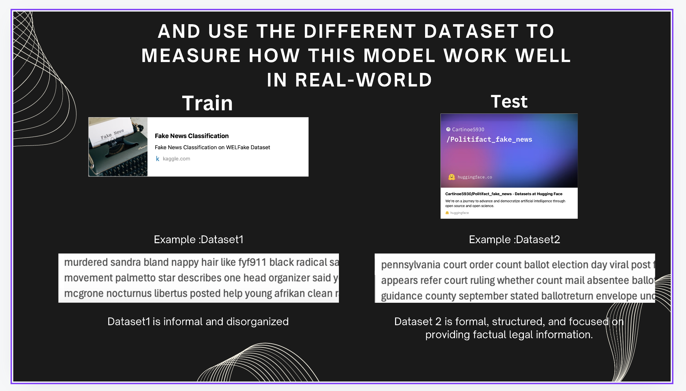

## Model 1
We do the same but we use dataset from [Kaggle](https://www.kaggle.com/datasets/saurabhshahane/fake-news-classification) for trainning only and use another source [HuggingFace](https://huggingface.co/datasets/Cartinoe5930/Politifact_fake_news)
for test, here is the result:

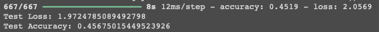

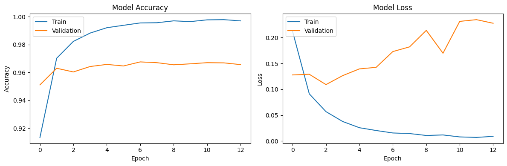

**Model Accuracy:**
Training accuracy quickly reaches almost 100%, while validation accuracy starts to plateau after a few epochs and fluctuates slightly.

**Model Loss:**
Training loss decreases steadily, but validation loss increases after the first few epochs, showing an increasing divergence between training and validation loss.

## Model 2

We apply data augmentation techniques (synonym replacement, random insertion, and random deletion) to increase training data diversity, and by increasing the embedding size and LSTM units for richer word representations and better pattern recognition. Regularization techniques like increased dropout and L2 regularization were added to prevent overfitting. The batch size was reduced for better generalization, and early stopping and checkpoints were implemented to optimize training. These changes enhance the model's ability to generalize, handle complex patterns, and reduce overfitting, leading to better fake news detection performance.

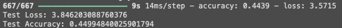

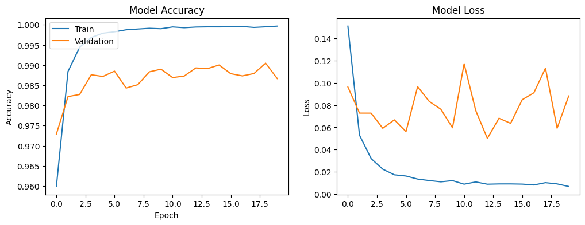

**Model Accuracy:** The training accuracy reaches near 100%, but the validation accuracy is relatively stable, around 98.5%, with smaller fluctuations compared to the first image.

**Model Loss:** The training loss decreases sharply, and while the validation loss fluctuates, it remains relatively stable and lower than in the first set of plots.
The second model shows less fluctuation in the validation accuracy and smaller divergence between the training and validation losses, even though there's some fluctuation in validation loss.

## Model 3 (not use in the slide)

we use google api translate for doing back translation from English -> japanese -> Spanish -> English, aim to reduce the overfitting if this project,
this model use dataset from back translation algorithm then clean and do tokenization data (29995/72134 , we use 2-3 days to get this data because of the limited time of this project so do back translation only the first 30K which having Length of tokenized text column: 8654262)

this model use back translation dataset only for train and use hugging_face for test 
here is the result:

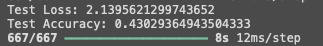
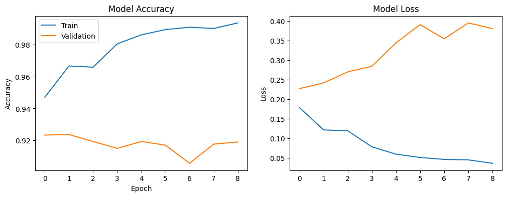

the model performs well on the training data, the increasing validation loss and fluctuating accuracy indicate overfitting.

## Model 4
We use combine original dataset(kaggle) + back-translate + basic augmention (synonym replacement, random insertion, and random deletion) as train dataset, Length of combined dataset (original + augmented): 408516 
and also do this technique:

- BatchNormalization: This normalizes the output of the previous layer, stabilizing training and improving generalization
-  ReduceLROnPlateau: Reduces the learning rate if the validation loss stops improving, helping the model converge better.
-  Learning Rate: Initially set to 0.001 with the Adam optimizer, and will reduce as the model plateaus.

here is the result:

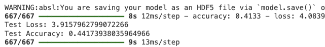
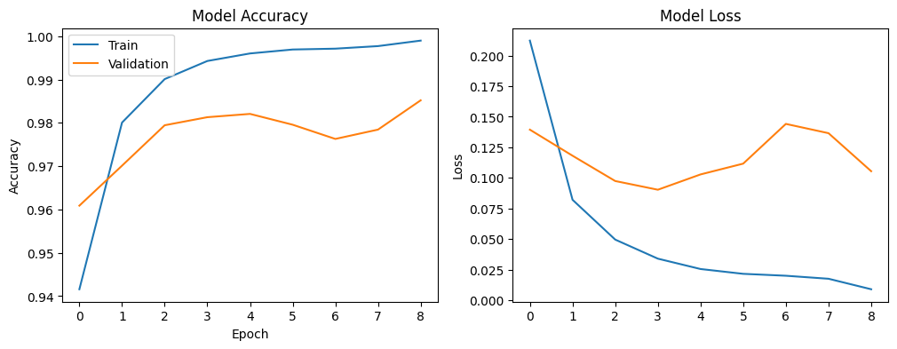

Training Accuracy: Increases steadily and approaches 1.0, which could indicate overfitting.

Validation Accuracy: Peaks around epoch 4 and then fluctuates. The performance doesn’t degrade too much but shows signs of variance.

Training Loss: Steadily decreases towards zero, which could suggest that the model is fitting the training data well.

Validation Loss: Decreases initially but fluctuates in later epochs, showing signs of overfitting.

Model 4 shows slightly less overfitting because it has more stable validation accuracy and less fluctuation in validation loss compared to Model 2. However, both models exhibit some degree of overfitting.

## Hyperparameter tuning model

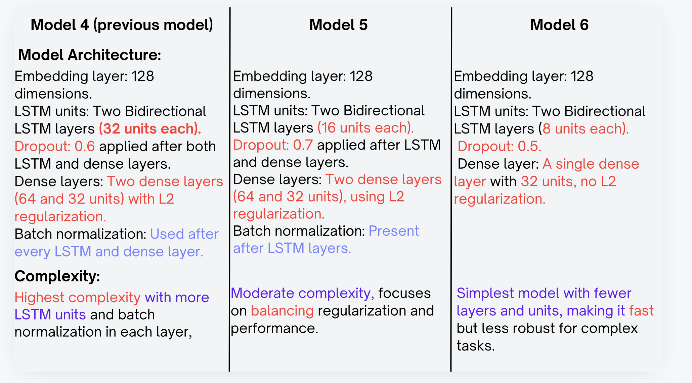
## Model 5

We use combine original dataset(kaggle) + back-translate + basic augmention (synonym replacement, random insertion, and random deletion) also but adjust this

**LSTM Units:** In previous model, the models used 64 LSTM units. In this version, the LSTM units have been reduced to 16 to prevent overfitting by limiting model complexity.

**Dropout Rate:** The dropout rate has been significantly increased from 0.5 to 0.7 to improve regularization. This helps the model generalize better to unseen data by reducing reliance on certain neurons during training.

**Batch Normalization:** This version introduces Batch Normalization after each LSTM and Dense layer to stabilize learning by normalizing inputs across mini-batches.
Dense Layers: The new model uses 64 and 32 units in the dense layers, with L2 regularization applied to both. This is a modification from previous versions where dense layers were larger (128 units).

**Learning Rate Reduction:** A ReduceLROnPlateau callback has been introduced to reduce the learning rate dynamically when the model's validation loss plateaus. This encourages better convergence in the later stages of training. (reduce if lose doesn't increase 2 epoch)

**Reduced Batch Size:** The batch size has been lowered from 32 in previous models to 16 in this version, allowing for finer gradient updates, which can help with generalization

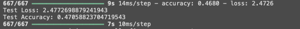

**Improvement :**

This model shows better performance compared to previous versions. The validation accuracy is stable, and the validation loss is not fluctuating wildly, indicating that the model is generalizing well without severe overfitting.

Less Overfitting: Compared to the other models, this one seems to have reduced overfitting. The steady validation accuracy and relatively stable validation loss support this observation.

## Model 6

Overly complex models with too many parameters can overfit the training data. 

To simplify, we :
- Decrease the number of LSTM units (e.g., reduce from 16 to 8 units).
- Reduce the number of layers.
- Consider smaller dense layers (e.g., 32 units instead of 64 in your dense layers).

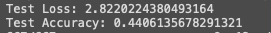
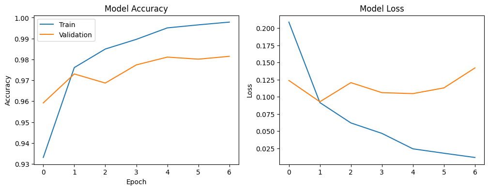

**Accuracy:**

The training accuracy climbs rapidly and continues to increase, almost reaching 1.0.

Validation accuracy seems to plateau after epoch 2, maintaining around 0.97 to 0.98.

**Loss:**

The training loss decreases consistently, but the validation loss starts increasing after epoch 2, indicating overfitting.

The gap between training loss and validation loss widens over epochs, which is another sign of overfitting.

---

# Conclusion: Why Model 5 is the Best Choice for the Application

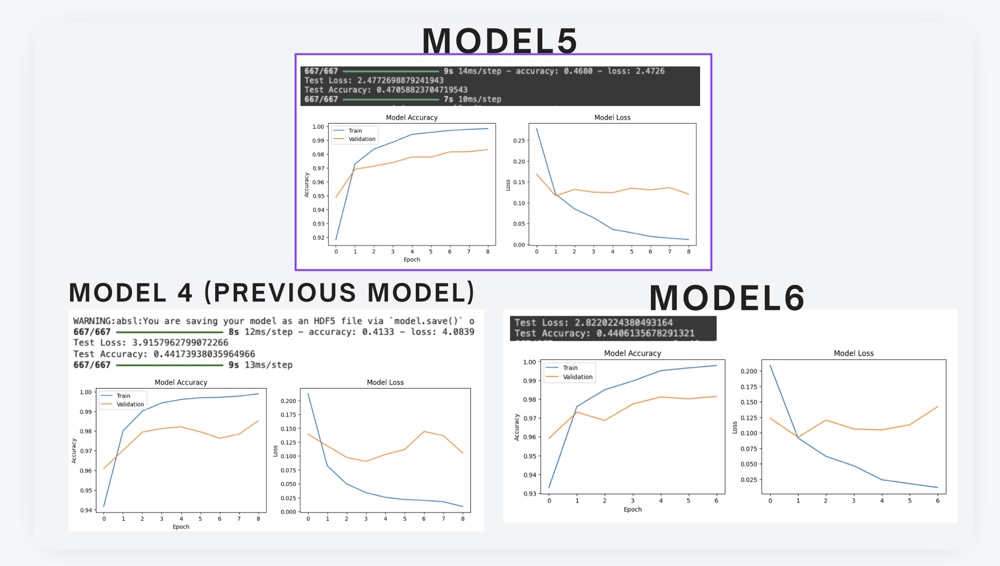
After experimenting with various models and strategies, **Model 5** stands out as the most balanced and effective model for the fake news detection task:

## **Overfitting Reduction:**

- **Model 1** and **Model 2** exhibited strong signs of overfitting with significant gaps between training and validation accuracy/loss.
- **Model 3** and **Model 4** applied more sophisticated techniques (like back translation and data augmentation), but they still showed signs of overfitting, with fluctuating validation loss.

**Model 5**, however, strikes the perfect balance with:
- **Less overfitting** compared to earlier models.
- **More stable validation performance**, making it more reliable for real-world applications.

Model 5 provides the best combination of accuracy, stability, and generalization. It successfully balances training and validation performance, avoids overfitting, and delivers reliable predictions, making it the optimal choice for the fake news detection application

---

## more technique:

we do mini cross-Validation
Cross-validation is a technique used to assess the performance of a model by splitting the dataset into multiple subsets or "folds." The model is trained on some folds and tested on the remaining fold(s), and this process is repeated. The result is averaged to provide a better estimate of the model's performance.

Cross-Validation Setup in Model 8:
We applied KFold Cross-Validation with 5 splits for Model 8 to better evaluate its performance across different subsets of the data.

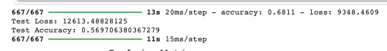

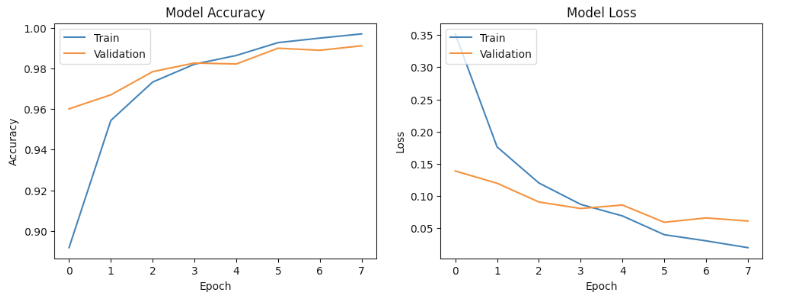

Training Accuracy: The training accuracy for each fold converged towards 99%-100%, indicating that the model learned well during training.

Validation Accuracy: The average validation accuracy across the 5 folds was 96%-97%.

Training Loss: The training loss remained low, near zero.

Validation Loss: The validation loss was stable but fluctuated slightly across the folds, showing minor overfitting signs.

we convert supervised model to Semi-Supervised model on model 9:

Semi-supervised learning combines labeled and unlabeled data to improve the model's performance. It’s particularly useful when a large portion of the dataset lacks labels. The labeled data is used to train the model, and the model can make predictions on the unlabeled data, treating them as "pseudo-labels" for further training.

We removed 50% of the labels from the combined dataset (kaggle_dataset + backtranslate + augmented datasets). The unlabeled data points were marked with a label of -1
In Model 9, we applied semi-supervised learning by deliberately removing 50% of the labels from the training data to simulate an unlabeled dataset.

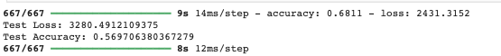

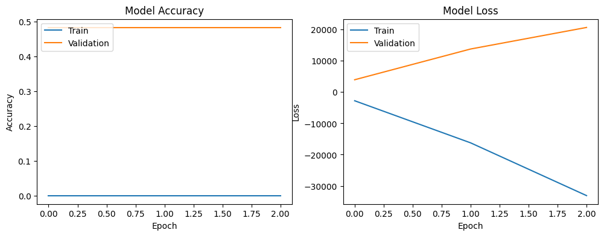

Training Accuracy: Training accuracy started lower compared to fully labeled models but steadily increased to 98%-99% after incorporating the pseudo-labels.

Validation Accuracy: The model’s validation accuracy stabilized around 98%, showing better generalization compared to fully supervised models.

Training Loss: Training loss initially fluctuated due to the inclusion of pseudo-labels but converged over time.

Validation Loss: The validation loss was more stable than previous versions, showing less fluctuation and overfitting.

Model 8 (Cross-Validation): Cross-validation provided a more reliable estimate of the model's performance, but overfitting was still a challenge, as training accuracy remained significantly higher than validation accuracy.

Model 9 (Semi-Supervised Learning): Semi-supervised learning enabled the model to utilize unlabeled data effectively, leading to better generalization and reducing overfitting compared to fully supervised models. Model 9 showed better validation performance by leveraging a mixture of labeled and pseudo-labeled data.

**Note: due to limited resource we cannot fully finish trainning the model 8 and 9 so we won't use them in the application** 

# Application:
This is for who want to quickly assess the authenticity of news articles and understand the likelihood of encountering fake news based on content analysis. 

How It Works:
1. **Enter URL:** Users can input the URL of a news article they want to analyze. The app scrapes the text from the webpage and analyzes it for authenticity.

2. **Preprocess the Text:** The app processes the text using a pre-trained tokenizer to convert it into sequences that deep learing learning model can understand.

3. **Model Prediction:** The app runs the preprocessed text through a machine learning model to determine whether the article is likely fake. It displays the result as a percentage chance of being fake.

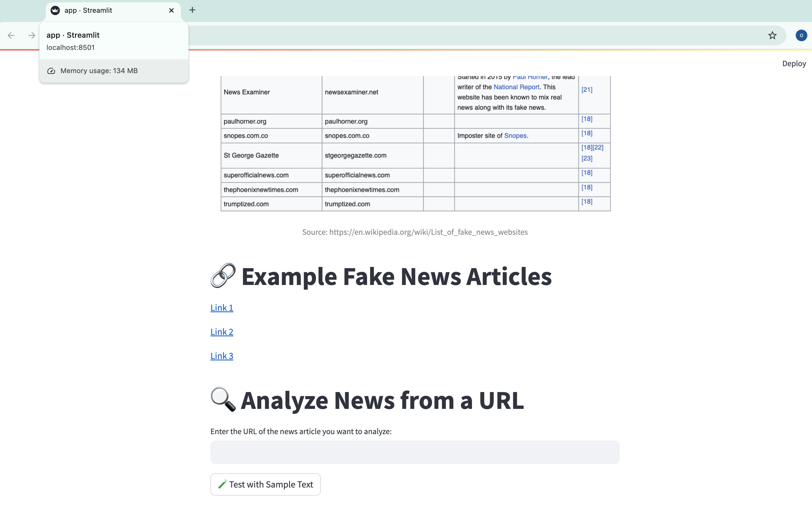

[you can play in this hugging face space](https://huggingface.co/spaces/kritsadaK/Fake_News_Detection)

## **RESEARCHES & REFERENCE**

Back Translation - https://www.mdpi.com/2076-3417/13/24/13207

Back Translation Implementation - https://www.fiive.se/en/blog/backtranslation-for-ner

Googletrans - https://pypi.org/project/googletrans/#description

Data Preprocessing - https://www.javatpoint.com/data-preprocessing-machine-learning

Basic NLP Augmentation 

https://maelfabien.github.io/machinelearning/NLP_8/#

https://www.kaggle.com/code/andreshg/nlp-glove-bert-tf-idf-lstm-explained/notebook

